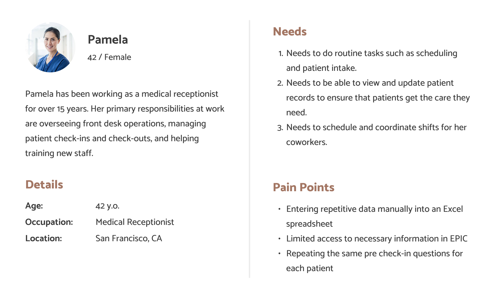

# COGS 127 Case Study

Alice Ma, Kelly La, Jessica Ouyang, Amy Yee

## Background
In a medical setting, the medical receptionists are the first point of contact for patients in person and over the phone. In general, they are responsible for organizing the medical office's operations. 

Our two stakeholders, both medical receptionists, ensure the smooth running of the medical office by communicating with clients/patients, managing schedules, making appointments, addressing patient inquiries, and more.

In a typical workday, medical receptionists rely on multiple digital tools to streamline workflow. However, inefficiencies in these systems often lead to frustration and delays in patient care. By exploring their experiences and challenges, this project aims to identify opportunities to improve workflow efficiency and enhance the overall patient care experience.

## User Research Method
We are conducting **two stakeholder interviews**. We conducted the first interview before Milestone 1 and conducted the second interview before Milestone 2.

**Stakeholder 1:** The person I have contacted is the head intern of the research department. He leads interns in the research department, organizing shifts, coordinating tasks, and training interns. He also does work with papers that his department is working on as well as a large project that the clinic is involved in.

**Stakeholder 2:** The person I have contacted for this project is someone working at NEMS front desk in San Francisco. She has been working there for around 30 years. She works front desk on the pediatrician floor and is responsible for taking calls, making appointments, and organizing schedules for her co-workers.

 

#### Pre-Interview and Set-Up Questions
We met up with our stakeholders in person and conducted an interview for 1-1.5 hours. To start off our interview, we told the stakeholders that the goal of the interview was to learn more about how they interact with applications at work, in hopes of gaining insight about challenges/frustrations that they face. We also made sure to inform them that being a stakeholder involved providing feedback and testing for future milestones.

**Photograph consent:** We will not be asking to take photos/videos due to the information being confidential to protect the patient's privacy and security.

**Audio consent:** Additionally, do we have your permission to record audio of your interview responses for us to analyze later?

[Stakeholder 1 Interview Response](interview-responses/stakeholder1-interview-response.md)

[Stakeholder 2 Interview Response](interview-responses/stakeholder2-interview-response.md)

 

### User Research Findings
#### Stakeholder 1
**Pain Points**
- eCW is frustrating; software seems old, and can only interact with one window at a time; requires too many clicks to complete simple navigation
- To go back to a previous window, eCW requires you to exit out, which could cause a break in workflow and information loss
- Cannot cross-reference different windows (violating “recognition rather than recall”)

**Wishes and Desires**
- Stakeholder 1 wishes that eCW has a more efficient “order of things”

**Opportunities/Gaps**
- Explore electronic medical record systems and identify how to enhance user workflow

 

#### Stakeholder 2
**Pain Points**
- EPIC restricts 2 people from viewing the same patient file, resulting in delayed patient care. 
- Schedules and availability on Excel Sheet need to be manually updated for each day
- Frustrated with repetitive actions
- Need to keep track with last minute schedule changed manually
- Stakeholder needs to ask patient the same pre check-in questions every time they come in (even if the patient is visiting frequently), which feels repetitive for the stakeholder 

**Wishes and Desires**
- Stakeholder 2 wishes there was an auditory way to notify others when someone wants to view the file they are on

**Opportunities/Gaps**
- Explore electronic medical record systems and identify how to reduce restrictions to create a more efficient user workflow

 

## Problem Statement
Through our stakeholder interviews, we found that medical administrators in clinics struggled with record management systems that lack automation and required switching between multiple programs to complete a task. As a result, our stakeholders experienced frustration with having to swap between multiple windows, causing delays in updating critical records.

 

## Personas
**Persona 1**

**Persona 2**

## Competitive Audits
### NexGen Health

**Description:** A cloud-based healthcare suite that focuses on practice management, including scheduling and patient records. Relevant to your efficiency concerns.

**Strengths:**
- Comprehensive electronic health records system with built-in scheduling
- Strong customize for different clinic sizes
- Mobile accessibility for patient portals

**Weaknesses:**
- Cluttered UI that is unintuitive to use
- Heavy training required for new users
- Limited automation for appointment scheduling and confirmation

 

### Oracle Health

**Description:** Another major healthcare platform offering scheduling, patient records, and communication tools. Addresses similar workflow challenges mentioned in your statement.

**Strengths:**
- Widely used at the enterprise level as a electronic health record
- Utilizes AI-powered analytics to show patient insights

**Weaknesses:**
- Complex UI which complicate simple tasks for receptionist
- Reportedly there have been lags in performance

 

### Athena Health

**Description:** A cloud-based healthcare suite that focuses on practice management, including scheduling and patient records. Relevant to your efficiency concerns.

**Strengths:**
- Cloud based system with user friendly design
- Automated reminders for appointments
- Virtual visit capabilities

**Weaknesses:**
- Limited customization for different practice needs
- Scaling challenges for larger medical groups

 

### Calendly

**Description:** A software company that develops a business communication platform used for teams to schedule, prepare and follow up on external meetings.

**Strengths:**
- High ease of use with minimal training required
- Automated scheduling system
- Ideal for multi-party scheduling coordination

**Weaknesses:**
- Not an electronic health records system
- Limited app scope (not directly related to medical field)

 

## UX Flows
### Flow 1: Checking-In
Currently, our stakeholder has to help patients check-in, which requires asking patients the same questions every time they come in. The stakeholder feels that this is repetitive, so our goal for this flow is to redesign the flow of checking in patients to reduce load for stakeholders. This flow lays out a self-service pre-check-in feature for patients to enter their personal information, which aims to minimize repetitiveness and load for receptionists.

### Flow 2: Updating Patient Records
Currently, our stakeholders have to constantly switch between different websites and windows in order to update patient records. Our goal for this flow is to make it easier to update patient records without constantly switching between websites and windows. To accomplish this, this flow will allow users to update patient records within a single, integrated system, minimizing the need to switch between multiple websites and windows

 

## UI Sketches
### Flow 1: Checking-In

### Flow 2: Updating Patient Records

 

## Low-Fidelity Wireframe Prototype
### Flow 1: Checking-In

[Link to Prototype](https://www.figma.com/proto/aRmk24vQ6H81aRd88dIVVg/cogs-127-case-study?node-id=36-239&t=NshxKHfVtglAPHCL-1&scaling=min-zoom&content-scaling=fixed&page-id=35%3A400&starting-point-node-id=36%3A239&show-proto-sidebar=1){:target="_blank"}

### Flow 2: Updating Patient Records

[Link to Prototype](https://www.figma.com/proto/aRmk24vQ6H81aRd88dIVVg/cogs-127-case-study?node-id=50-201&t=IpbEAwXj2aa9SczI-1&scaling=min-zoom&content-scaling=fixed&page-id=35%3A400&starting-point-node-id=50%3A201&show-proto-sidebar=1){:target="_blank"}

### Design Decisions
We decided to do two different prototype flows to show the two main problems our stakeholders had. Each of the flows will help with different issues. Flow 1 alleviates the frustration of repetitively asking the same questions to help patients check in by providing a self-check-in option. Patients will be able to carefully read the questions at their own pace and edit any information on their profiles. This low-fidelity prototype follows the UX flow of milestone 3 but combines the UI sketch flows for flow 1 of milestone 3. We chose these specific UI designs to maximize clarity and visibility so that users can easily see their information without it being too cluttered and confusing. We kept the homepage simple and straightforward and used concise panels for the homepage and the view appointments page so that patients can view more information at a glance. The check-in questionnaire should have enough information to be self-explanatory, and the confirmation page is clear and does not require scrolling.

Flow 2 differs by addressing a different stakeholder issue. Rather than focusing on the repetitive check-in process, flow 2 aims to assist stakeholders by simplifying their workflow. Currently, our stakeholders need to switch between different programs and windows to update patient records, so flow 2 aims to streamline this process and limit the amount of switching between programs. Our low-fidelity prototype for flow 2 matches our UX flow for milestone 3. The prototype mostly matches our UI sketches, with only a few screens differing. Screen four, spine x-rays, has been changed to make the contact names and information more visible. This flow adds a built-in communication system so that our stakeholders will be able to retrieve and update patient files and results without needing to switch to a different program. The user will be able to contact other departments on the same website as well as add the newly acquired files without having to manually download and upload the files. This will streamline the process and reduce the amount of program switches in a workflow.

 

## User Testing Results
### Methods
For our user test, we interviewed two stakeholders. One stakeholder is a head intern at a neurosurgery clinic, and the other is an ER intern. We found them through contacting mutual friends.

Our interview questions include two tasks, one per flow. After each task, we asked the participants a series of follow-up questions about the prototype, so that we can understand what they liked/disliked about it, as well as identify any areas of frustration and confusion.

**Tasks:**

**1. Check-In (Flow 1)**
- Scenario: A patient comes in for their appointment and needs to check in. You inform the patient to complete a self-service online check-in. Complete the check-in process from the patient’s perspective.

**2. Update Record (Flow 2)**
- Scenario: You need to update a patient’s medical record. Find the first patient, and update their x-ray records by contacting the company through email. View the email and update the x-ray records.

 

[Stakeholder 1 Feedback](/interview-responses/stakeholder1-feedback.md)

[Stakeholder 2 Feedback](/interview-responses/stakeholder2-feedback.md)

### Findings
**Flow 1: Check-In**

Our first user thought that the check-in flow satisfies the general requirements of typical check-in at a clinic. He liked how the flow's design was very bare and simple because it makes it easier for patients to check in. FOr this flow, he thought that the steps were clear and did not get confused by any of the steps.

Our second user thought that this check-in process was straightforward and efficient since it only required a Login and a few questions. They thought the button was easy to distinguish which made navigation easy. Something they didn’t like was how some aspects were too similar when they are not related which could cause confusion. Overall, Flow 1 was found to be more intuitive than Flow 2 since they didn’t need to think twice about what to do on each page.

**Flow 2: Updating Patient Record**

Our first user thinks that this flow would be very efficient for use in the office because everything was accessible from a singular interface, without the need to browse through many different websites to update a patient’s records. While he didn’t struggle with using this prototype, he brought feasibility into question because it seems difficult for such a currently complex process to be boiled down to one interface; however, if it is possible, he thinks that it would be amazing. One thing he was confused about was the email feature and the types of files that can be received through it.

Our second user this flow made updating medical records efficient since there were no unnecessary complexities. They liked that they can send messages within the interface instead of reaching externally. Something they didn’t like was how some buttons were not obvious. A worry they have is distinguishing patients with similar name/age and suggest clearly patient identifiers. Another worry would be the incoming message notification as it could be hard to keep track of messages.

**Overall**

Our first user found both flows equally intuitive but thought that the second flow would be more useful for his current workflow, as his position requires him to upload patient medical files and communicate with other companies.

Our second user found the first flow more intuitive since the second one had less intuitive icons. This user also thought that the first workflow would save a lot of time since they usually input all of that information by themself. The user thought that this flow would save time for them and the patients.

 

## Point of View Statement
During user testing, we discovered that users liked both prototypes. Our users liked the simplicity of flow 1 because of the lack of unnecessary information. While the prototype for flow 1 would reduce the workload for our users, this prototype is meant to be used by patients rather than our stakeholders. They found it confusing on how it would be implemented in real life. For flow 2, our users liked that it simplified the process by using a single interface, but our stakeholders were concerned about the feasibility of combining multiple processes into one. We believe flow 2 should be further developed based on our stakeholders frequent tasks.

 

## High Fidelity Prototype
